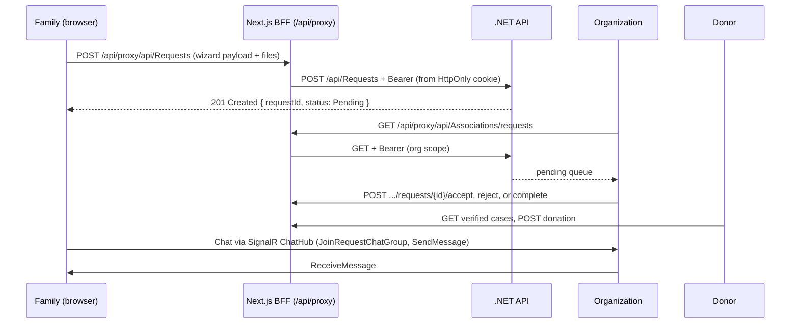
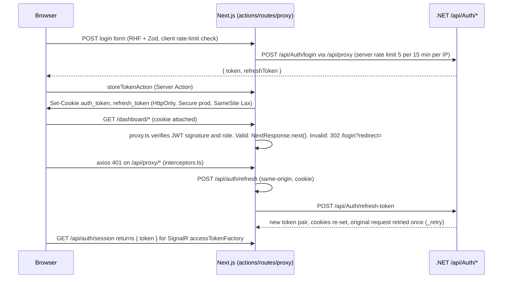

<div align="center">

# 🤝 Aoun Platform — عون

**A multi-tenant charitable aid platform connecting donors, charitable organizations, and families in need.**

Four distinct user roles · Real-time messaging · AI assistant · Arabic-first (RTL) · Backend-for-Frontend (BFF) security boundary


*Graduation project — frontend web client (`Aoun.Web`). Backend: ASP.NET Core REST API + SignalR Hub (`ChatHub`) + FastAPI AI microservice (consumed, not in this repo).*

> **Repository status:** The frontend currently has passing type-checks, tests, and production build according to the latest validation notes in this document. ESLint still reports 27 legacy errors, so `npm run validate` is not yet green. The remaining security/design notes are documented in §24.


</div>

---

## 📑 Table of Contents

1. [Problem Statement & Objectives](#1--problem-statement--objectives)
2. [Roles & Access Model](#2--roles--access-model)
3. [System Architecture](#3--system-architecture)
4. [Request Lifecycle (Core Business Flow)](#4--request-lifecycle-core-business-flow)
5. [Engineering Highlights](#5--engineering-highlights)
6. [Auth & Session Flow (Deep Dive)](#6--auth--session-flow-deep-dive)
7. [BFF Proxy Contract](#7--bff-proxy-contract)
8. [Real-time Chat Architecture](#8--real-time-chat-architecture)
9. [AI Assistant Integration](#9--ai-assistant-integration)
10. [Aid Request Wizard (State & Validation)](#10--aid-request-wizard-state--validation)
11. [Tech Stack (Exact)](#11--tech-stack-exact)
12. [Project Structure & Module Boundaries](#12--project-structure--module-boundaries)
13. [API Reference (Consumed)](#13--api-reference-consumed)
14. [Environment & Configuration](#14--environment--configuration)
15. [Getting Started](#15--getting-started)
16. [Scripts, Lint, Test & Type-safety](#16--scripts-lint-test--type-safety)
17. [Security Hardening Checklist](#17--security-hardening-checklist)
18. [Performance & Rendering Strategy](#18--performance--rendering-strategy)
19. [Internationalization & RTL](#19--internationalization--rtl)
20. [Observability, Logging & Error Handling](#20--observability-logging--error-handling)
21. [Deployment](#21--deployment)
22. [Troubleshooting](#22--troubleshooting)
23. [Functional vs Non-functional Requirements](#23--functional-vs-non-functional-requirements)
24. [Limitations & Future Work](#24--limitations--future-work)
25. [Engineering Decisions & Trade-offs](#25--engineering-decisions--trade-offs)
26. [Contributors](#26--contributors)

---

## 1. 🎯 Problem Statement & Objectives

Charitable aid in the region is still coordinated over **phone calls, paper files, and spreadsheets**. That causes:

- Duplicate / unverifiable aid requests with no audit trail.
- Donors cannot see where money goes (low trust → fewer donations).
- Organizations waste time on manual verification and cross-calls.
- Families re-submit the same documents to every organization.

**Aoun digitizes the full loop:**

```text
Family submits verified request → Organization reviews / verifies / approves
→ Donor funds a verified case → All parties track outcome in real time
```

**Measurable objectives:**

| # | Objective | How it is verified in this repo |
|---|-----------|---------------------------------|
| O1 | Role-isolated UX (no privilege confusion) | `src/proxy.ts` gate (`isRoleAllowed`) + `dashboard/` role routes + `ROUTES` constants |
| O2 | No bearer token persisted in browser storage | HttpOnly cookies for persistent session storage; browser calls `/api/proxy/*`; SignalR currently receives a transient in-memory token via `/api/auth/session` |
| O3 | Validated, step-by-step aid-request intake | 5-step wizard, per-step Zod schemas (`requestSchema.ts`), `stepFieldNames` map |
| O4 | Real-time family↔organization chat | `useChat.ts` — SignalR `ChatHub` via `/api/proxy/hubs/chat` (LongPolling) + REST fallback |
| O5 | AI-assisted intake/Q&A with streaming | `/api/ai/chat/stream` SSE proxy → FastAPI; `useStreamingChat.ts` |
| O6 | Arabic-first RTL without style forks | Logical CSS properties, Cairo font, Arabic Zod messages |
| O7 | Fail-fast production config | `src/env.ts` Zod validation + `NEXT_PUBLIC_*` leak detector, imported in `next.config.ts` |

---

## 2. 👥 Roles & Access Model

This is **not one UI with hidden buttons**. Each role gets its own navigation tree, dashboard composition (`src/features/dashboard/`), and API scope. The gate runs **server-side in `src/proxy.ts`** before any protected markup is served.

| Role | Capabilities | Dedicated Surface |
|------|--------------|-------------------|
| **Family** | Submit/track aid requests, upload supporting documents, message organizations | Request wizard (`features/requests/`), request timeline, `Families/profile` |
| **Donor** | Browse verified cases, donate, track cumulative impact | Explore page (`app/explore/`), impact dashboard, donation history (`features/donations/`) |
| **Organization (Association)** | Review, verify, accept/reject/complete requests, manage beneficiaries, analytics | Case console, `Associations/requests`, `Dashboard/Association/analytics` |
| **Admin** | Platform oversight, organization verification, support tooling | Admin console (`features/admin/`, `useAdminData.ts`, `adminApi.ts`) |

**Route enforcement (`src/proxy.ts`):**

- `PUBLIC_ROUTES` → always allowed.
- `/api/*`, `/_next/*`, static assets → bypass the page guard (API auth is enforced by the .NET API + cookie→Bearer injection in the proxy branch).
- Everything else requires a **signature-verified** `auth_token` cookie (`verifySessionEdge()`); anonymous, expired, or forged sessions are 302-redirected to `/login?redirect=<path>`.
- Role check: `normalizeRole()` + `isRoleAllowed` redirect non-admin roles out of foreign `/dashboard/*` prefixes.
- Authenticated users hitting `/login|/register|/forgot-password|/reset-password|/verify-code` are redirected to their dashboard.

> See [§6](#6--auth--session-flow-deep-dive) for the exact cookie/JWT/refresh sequence.

---

## 3. 🏗️ System Architecture

### 3.1 High-level topology

```text
┌──────────────────────────────┐
│   Browser (React 19 / RSC)   │
│   HttpOnly cookie; nothing   │
│   persisted in JS storage    │
└──────────────┬───────────────┘
               │  same-origin only
┌──────────────▼───────────────┐
│  Next.js 16 (App Router)     │
│  ├── src/proxy.ts (gate +    │
│  │    /api/proxy forwarder)  │
│  ├── RSC / Server Actions    │
│  │    (storeTokenAction)     │
│  ├── /api/auth/* (session,   │
│  │    refresh — cookie I/O)  │
│  └── /api/ai/* (SSE stream,  │
│       confirm, voice)        │
└───┬───────────┬───────────┬──┘
    │           │           │
┌───▼──────┐  ┌─▼───────┐  ┌▼──────────────┐
│ .NET 8+  │  │ SignalR │  │ FastAPI AI    │
│ REST API │  │ ChatHub │  │ /api/ai/chat/ │
│ :5204    │  │ /hubs/  │  │ stream (SSE)  │
│ (YARP:   │  │ chat    │  │ :8000         │
│ /api/ai/ │  │         │  │ X-API-Key opt │
│ →AI)     │  │         │  │               │
└──────────┘  └─────────┘  └───────────────┘
```

**Key constraint:** the browser's `connect-src` in production is `'self'` only (set in `src/lib/security/csp.ts`, applied per request by `src/proxy.ts`). It never dials the .NET or AI origins directly — everything is same-origin through the BFF. Backend hosts are derived **from env at build time** (`safeParseOrigin`), never hardcoded.

> ℹ️ In Next.js 16, `proxy.ts` replaces `middleware.ts` and runs on the **Node.js runtime** (not Edge). Identifiers such as `verifySessionEdge` / `edgeAuth.ts` keep their historical names.

### 3.2 Next.js request paths

| Browser call | Next.js handler | Upstream | Auth injection |
|--------------|-----------------|----------|----------------|
| `/api/proxy/<path>?q` | `src/proxy.ts` (forwarder branch) | `${API_URL}<path>?q` (YARP routes `/api/ai/**` to FastAPI) | `Authorization: Bearer <auth_token cookie>` server-side |
| `POST /api/auth/refresh` | `app/api/auth/refresh/route.ts` | `.NET /api/Auth/refresh-token` | HttpOnly `refresh_token` cookie |
| `GET /api/auth/session` | `app/api/auth/session/route.ts` | — (reads cookie, returns a short-lived session token for SignalR `accessTokenFactory`; held in memory only) | cookie → JSON `{ token }` |
| `POST /api/ai/chat/stream` | `app/api/ai/chat/stream/route.ts` | `${AI_API_URL}/api/ai/chat/stream` (SSE passthrough) | `Authorization: Bearer` + optional `X-API-Key` |
| `POST /api/ai/chat/confirm`, `/api/ai/voice` | corresponding route handlers | AI service | same as above |

### 3.3 Rendering strategy

- **Public/marketing pages** (`app/page.tsx`, `app/explore/`) — static generation where possible for speed + SEO (`app/robots.ts`, metadata `APP_URL`).
- **Authenticated dashboards** (`app/dashboard/`) — per-request React Server Components: auth + data fetch stay on the server; client components only for interactive islands (chat, wizard, forms).
- **Security headers** (`HSTS`, `X-Frame-Options`, `nosniff`, `Referrer-Policy`, `Permissions-Policy`) are set globally in `next.config.ts`. The **Content-Security-Policy is set per request in `src/proxy.ts`** (nonce-based, built by `lib/security/csp.ts`) — the static CSP was intentionally removed from `next.config.ts` so two policies are not AND-combined.

---

## 4. 🔄 Request Lifecycle (Core Business Flow)



**Status machine (backend-owned, frontend-rendered):** `Pending → UnderReview → Accepted/Rejected → Completed`, plus family-side `Cancelled` (`DELETE /api/Requests/{id}/cancel` → `requestsApi.ts`). The wizard payload shape is typed by `baseRequestFormSchema` and must match `CreateAssistanceRequestDto` on the .NET side.

---

## 5. ✨ Engineering Highlights

### 🔐 Server-side authorization, not client-side hiding

`src/proxy.ts` runs before rendering and **verifies the JWT signature** (`verifySessionEdge()`). Anonymous users never receive protected markup. Tokens live in **HttpOnly, `Secure` (prod), `SameSite=Lax`, `Path=/`, 7-day** cookies (`src/lib/security/authCookies.ts`) set exclusively via Server Actions (`storeTokenAction`/`removeTokenAction`) — never `document.cookie`, never `localStorage`.

### 🛡️ BFF proxy pattern (proxy layer as API gateway)

The browser only knows `/api/proxy`. The forwarder (`src/proxy.ts`):

1. Strips `host/cookie/origin/referer/connection/content-length`.
2. Injects `Authorization: Bearer <auth_token>` from the cookie.
3. Forwards with `cache: no-store`, reads non-GET bodies as `ArrayBuffer` (fixes empty-POST hangs like SignalR `negotiate`).
4. Streams the upstream body back verbatim, drops `set-cookie`/`content-encoding`.
5. Returns `502` with an Arabic message on upstream failure — upstream URLs never leak to the client (only dev logs the target).

Benefits: the bearer is not persisted in browser storage and is not attached by client code for REST calls; there is no browser↔.NET CORS requirement; retry/refresh/error normalization has one server-side boundary; backend hosts stay server-only. SignalR is the documented exception because its client currently needs a transient in-memory token.

### ⚡ Real-time messaging over SignalR (LongPolling through the proxy)

`src/features/chat/hooks/useChat.ts` builds the hub at `/api/proxy/hubs/chat` with `accessTokenFactory` (token from `/api/auth/session`) and **forces `LongPolling`** so the proxy doesn't need WebSocket upgrades. Features: `Join/LeaveRequestChatGroup`, `SendMessage`, `SendTypingStatus`, `ReceiveMessage`/`UserTyping` handlers, a single SignalR source of truth with `mergeMessages()` dedupe/reconciliation (`chatMerge.ts`), `withAutomaticReconnect([0, 2s, 5s, 10s, 30s])`, optimistic send with REST fallback + `retryMessage`, history heal on reconnect / tab-visible, and throttled typing presence. (Known cost of LongPolling — see [§25](#25--engineering-decisions--trade-offs).)

### 🧩 Multi-step aid request wizard

5 steps (0 Basic → 1 Employment+Location → 2 Health → 3 Financial → 4 Attachments). **Each step has its own Zod schema** (`step0Schema…step3Schema` in `requestSchema.ts`) with Arabic `superRefine` cross-field rules (e.g. `requestType==="Other"` requires `otherRequestType`; `isWorking` toggles job fields vs `unEmploymentReason`; `housingType==="Rented"` requires `rentMonthly`), composed into `requestFormSchema` for final submit. `stepFieldNames` scopes RHF validation to visible fields; `defaultFormValues` aligns with backend nullables; `z.coerce.number()` tolerates text-input numerics.

### 🤖 Streaming AI assistant (SSE passthrough)

`POST /api/ai/chat/stream` forwards to FastAPI with `duplex: "half"` and returns the raw `ReadableStream` as `text/event-stream` (`Cache-Control: no-cache`, `Connection: keep-alive`). `useStreamingChat.ts` consumes the SSE tokens progressively. Confirm + voice flows have dedicated route handlers (`chat/confirm`, `ai/voice`).

### 🌍 Arabic-first, natively bidirectional

Cairo font (`app/fonts/`, `fontFamily.sans`), logical CSS properties (`inline-start/end`), dir-aware sidebars/drawers/popovers/animations. All user-facing validation strings are Arabic at the schema level — no translation-key indirection for the MVP locale.

### 🏗️ Feature-Sliced Design (12 domains)

`admin, associations, auth, chat, dashboard, donations, families, home, notifications, profile, requests, settings` — each with `api/ hooks/ components/ types/` slices and an `index.ts` public barrel. **Boundary rule:** `features/* → shared/*, lib/*` only; never feature-to-feature. Shared behavior is promoted to `shared/`.

---

## 6. 🔑 Auth & Session Flow (Deep Dive)



> ⚠️ **SignalR token exposure:** `/api/auth/session` returns the session token to client JS (kept in memory only, never persisted) so the SignalR client can attach it. This is the one place where the token is readable by page JS; see [§24](#24--limitations-security-notes--future-work).

**Files:**

| Concern | File |
|---------|------|
| Credential submit + dual registration (family/association/donor) | `features/auth/hooks/useLoginForm.ts`, `useRegisterForm.ts`, `types/schema.ts`, `utils/register-validation.ts` |
| Cookie write/delete (server-only) | `src/app/actions/authActions.ts` + `src/lib/security/authCookies.ts` |
| Browser API client | `src/lib/api/client.ts` (axios, 30s timeout) + `config.ts` (`baseURL: '/api/proxy'` in browser) |
| 401 → refresh → single retry → `AUTH_UNAUTHORIZED` event | `src/lib/api/interceptors.ts` |
| Signature + role verification at the gate | `src/lib/security/edgeAuth.ts` (`verifySessionEdge`, `normalizeRole`, `isRoleAllowed`) |
| Token verification helper | `src/lib/auth.ts` (`jose.jwtVerify`) |
| CSRF origin check (prod, state-changing page routes) | `src/proxy.ts` (`isSameOriginRequest`) |

**Refresh semantics:** login/refresh requests are excluded from auto-retry (no infinite loop). On refresh-401 the client clears both token keys and fires `APP_EVENTS.AUTH_UNAUTHORIZED` (unless on a public route) so the auth provider can redirect. The retried request reuses the cookie-injected Bearer — the proxy re-reads the fresh cookie, so no manual header patching is needed for proxied calls.

---

## 7. 🔌 BFF Proxy Contract

**Base:** browser `baseURL = '/api/proxy'` (`src/lib/api/config.ts`); server uses `process.env.API_URL`. Timeout 30s (`API_CONFIG.timeout`), `withCredentials: false` (cookies are same-origin; the Bearer is injected server-side, not by the browser).

**Forwarding rules (`src/proxy.ts`):**

- `GET/HEAD` → no body forwarded. Others → `await request.arrayBuffer()`, forward only if `byteLength > 0`.
- Dropped request headers: `host, cookie, origin, referer, connection, content-length`.
- Dropped response headers: `set-cookie, content-encoding`.
- `localhost` is rewritten to `127.0.0.1` (Node 18+ IPv6 `::1` breaks local ASP.NET).
- Rate limits (in-memory, per IP): auth mutations 5 / 15 min, general proxy 120 / min.
- Errors normalized to `{ message, statusCode, errors?, timestamp }` (`ApiError` in `lib/api/types.ts`); Arabic fallback strings per status (401/403/404/5xx/network) in `interceptors.ts`.
- Dev-only sanitized request/response logging (`sanitizeLogData` redacts `password/token/refreshToken/accessToken/secret/confirmPassword`).

---

## 8. 💬 Real-time Chat Architecture

```text
useChat(requestId)
 ├── GET history: chatApi.getMessages(requestId) → markAsRead if foreign unread
 ├── SignalR: HubConnectionBuilder().withUrl('/api/proxy/hubs/chat',
 │             { accessTokenFactory: session token, transport: LongPolling })
 │             .withAutomaticReconnect([0, 2s, 5s, 10s, 30s])
 │   ├── invoke JoinRequestChatGroup(requestId) / LeaveRequestChatGroup
 │   ├── invoke SendMessage({ assistanceRequestId, message })
 │   ├── invoke SendTypingStatus(requestId, bool)   (throttled)
 │   └── on ReceiveMessage / UserTyping (5s typing auto-clear)
 ├── State: single source of truth — mergeMessages() dedupe/reconcile (chatMerge.ts)
 ├── Send: optimistic UI → hub; REST fallback (chatApi.sendMessage) when hub not
 │         Connected; retryMessage() for failed sends
 ├── Healing: refetch history on reconnect and when the tab becomes visible
 └── Unread sync: markAsRead on receive/history when sender ≠ me
```

**Hub methods used:** `JoinRequestChatGroup`, `LeaveRequestChatGroup`, `SendMessage`, `SendTypingStatus`. **Events:** `ReceiveMessage`, `UserTyping`. StrictMode-safe via `connectionRef` + `aborted` flag. See `src/features/chat/hooks/useChat.ts` and `src/features/chat/api/chatApi.ts`.

---

## 9. 🤖 AI Assistant Integration

| Endpoint (browser) | Handler | Upstream | Notes |
|--------------------|---------|----------|-------|
| `POST /api/ai/chat/stream` | `app/api/ai/chat/stream/route.ts` | `${AI_API_URL}/api/ai/chat/stream` | SSE passthrough, `duplex: half`, forwards `Authorization: Bearer` + `X-API-Key` if set |
| `POST /api/ai/chat/confirm` | `app/api/ai/chat/confirm/route.ts` | AI service | Finalize/confirm an AI-drafted request |
| `POST /api/ai/voice` | `app/api/ai/voice/route.ts` | AI service | Voice input (mic permission is the only non-`()` permission granted in `Permissions-Policy`) |

Client: `src/shared/hooks/useStreamingChat.ts` (progressive token rendering) + `features/chat/` UI. AI/chat Markdown is rendered through `SafeMarkdown` (`rehype-sanitize` + `remark-gfm` + `sanitizeUrl` allow-list) — never through raw HTML injection.

---

## 10. 🧾 Aid Request Wizard (State & Validation)

**File:** `src/features/requests/components/wizard/schemas/requestSchema.ts` (the single source of truth for intake).

- **Enums:** `AssistanceTypeEnum = Medical|Financial|Utilities|Housing|Education|Food|Other`; `HousingTypeEnum = Owned|Rented|Provided|Other`.
- **Base schema:** `baseRequestFormSchema` — employment (`isWorking, workingType 0-4, employmentType 0-3, salaryMonthly…`), health (`hasInsurance, hasDisability, hasChronicDisease…`), living (`housingType, rentMonthly, monthlyExpenses, utilitiesMonthly, householdMonthlySpending, annualPayment…`), support (`registeredSocialSupport, otherAid*`), `location`, `attachments: File[]`.
- **Per-step schemas:** `step0Schema…step3Schema` via `.pick()` + `superRefine`; registry `stepSchemas: Record<number, ZodSchema>`; step 4 (attachments) intentionally unvalidated except client file checks.
- **Submit schema:** `requestFormSchema` re-applies all cross-field rules for the final payload.
- **Form defaults:** `defaultFormValues` mirrors backend nullables (`salaryMonthly: 0`, `attachments: []`, …).
- **API:** `src/features/requests/api/requestsApi.ts` (`POST /api/Requests`, `GET /:id`, `cancel`), config in `requests/config/requestConfig.ts`.

---

## 11. 🧰 Tech Stack (Exact)

| Layer | Technology (pinned) | Evidence |
|-------|---------------------|----------|
| **Framework** | Next.js `^16.0.8` (App Router, RSC, Route Handlers, `proxy.ts`) | `package.json`, `next.config.ts` |
| **Language** | TypeScript `^5.8.3`, `strict: true`, `target ES2022`, `moduleResolution bundler`, path aliases `@/*, @/features/*, @/shared/*, @/lib/*` | `tsconfig.json` |
| **UI** | React `^19.0.0`, shadcn/ui on Radix primitives, Framer Motion `^12.36.0`, `next-themes`, `sonner`, `lucide-react` | `package.json` |
| **Styling** | Tailwind CSS `^3.4.19` + `tailwindcss-animate`, CSS vars, logical properties, Cairo font | `tailwind.config.js`, `app/globals.css`, `app/fonts/` |
| **Forms** | React Hook Form `^7.68.0` + `@hookform/resolvers` + Zod `^4.3.6` | `package.json` |
| **HTTP** | Axios `^1.13.2` (client) + native `fetch` (proxy, AI SSE) | `lib/api/client.ts`, `proxy.ts`, `fetch.ts` |
| **Real-time** | `@microsoft/signalr ^10.0.0` | `useChat.ts`, `chatApi.ts` |
| **Auth** | `jose ^6.1.3` (`jwtVerify`), HttpOnly cookie sessions, Server Actions | `lib/auth.ts`, `authCookies.ts`, `authActions.ts` |
| **Data-viz / content** | Recharts `^3.9.0`, date-fns `^4.1.0`, react-markdown `^10.1.0` + `rehype-sanitize` + `remark-gfm` | dashboards, chat rendering |
| **Quality** | ESLint 9 + `eslint-config-next`, `typescript-eslint`, Jest 30 + `ts-jest` | `package.json` devDeps |
| **Backend (consumed)** | ASP.NET Core REST (`API_URL`, default dev `http://127.0.0.1:5204`) + SignalR `ChatHub` + FastAPI AI (`AI_API_URL`, default dev `http://127.0.0.1:8000`) | `src/env.ts` |

---

## 12. 🗂️ Project Structure & Module Boundaries

```text
Aoun.Web/
├── next.config.ts / tsconfig.json / tailwind.config.js / jest.config.js / eslint.config.mjs
└── src/
    ├── app/                      # Next.js App Router
    │   ├── page.tsx               # Landing (static)
    │   ├── explore/               # Donor case browsing
    │   ├── login/ register/ forgot-password/ reset-password/ verify-code/
    │   ├── dashboard/             # Role-scoped protected routes
    │   ├── api/
    │   │   ├── auth/session|refresh/  # Cookie session helpers
    │   │   └── ai/chat/stream|confirm + ai/voice  # AI SSE proxy
    │   ├── actions/authActions.ts # Server Actions: cookie set/delete
    │   ├── layout.tsx / LayoutContent.tsx / globals.css / fonts/
    │   └── robots.ts              # SEO (uses APP_URL)
    ├── proxy.ts                  # Gate (JWT verify + role) + /api/proxy forwarder + CSRF + nonce CSP
    │                             # (Next 16 replacement for middleware.ts; Node runtime)
    ├── env.ts                    # Zod env validation + NEXT_PUBLIC leak detector
    ├── features/                 # 12 isolated business domains (api/hooks/components/types)
    │   ├── admin/ associations/ auth/ chat/ dashboard/ donations/
    │   ├── families/ home/ notifications/ profile/ requests/ settings/
    ├── shared/                   # Cross-domain only
    │   ├── components/ (design system, role layouts, sidebars, SafeMarkdown)
    │   ├── hooks/ (useStreamingChat, useCountUp, use-mobile)
    │   ├── providers/ (auth, theme, realtime context)
    │   ├── constants/ (routes, app, colors)  # ROUTES, PUBLIC_ROUTES
    │   ├── types/ utils/ (cn, dateUtils, image, events → APP_EVENTS)
    │   └── ui/ (shadcn barrels)
    └── lib/
        ├── api/ (config, client, interceptors, fetch, types)
        ├── security/ (authCookies, tokenStorage, edgeAuth, csp, serverRateLimiter,
        │              rateLimiter [client, UX-only], sanitize)
        ├── auth.ts (jose verifyToken) / auth.test.ts
        └── logger.ts
```

**Boundary rule:** `features/*` may import from `shared/` and `lib/` — **never from another feature**. Shared behavior gets promoted to `shared/`. Path aliases enforce it (`@/*`).

---

## 13. 📡 API Reference (Consumed)

All browser calls are relative to `/api/proxy` (the prefix is stripped before forwarding). Full map: `src/lib/api/config.ts`.

| Domain | Method & Path | Purpose |
|--------|---------------|---------|
| Auth | `POST /api/Auth/login` | Login → token pair (cookies set server-side) |
| Auth | `POST /api/Auth/register/family\|association\|donor` | Role-specific registration |
| Auth | `POST /api/Auth/refresh-token` | Refresh via HttpOnly cookie |
| Auth | `POST /api/Auth/forgot-password`, `POST /api/Auth/verify-reset-code`, `POST /api/Auth/reset-password` | Recovery flow |
| Auth | `GET /api/Auth/me`, `POST /api/Auth/logout` | Session / logout |
| User/Profile | `GET|PUT /api/User/profile`, `POST /api/User/change-password` | Identity |
| Associations | `GET /api/Associations/profile`, `GET /api/Associations/requests`, `GET /:id`, `POST /:id/accept\|reject\|complete` | Case management |
| Dashboard | `GET /api/Dashboard/Association/undertakings\|analytics\|impact-report` | Org analytics (Recharts) |
| Families | `GET /api/Families/profile\|statistics` | Beneficiary data |
| Requests | `POST /api/Requests`, `GET /api/Requests/{id}`, `DELETE /api/Requests/{id}/cancel` | Intake + lifecycle |
| Chat (REST) | via `features/chat/api/chatApi.ts` (`getMessages`, `sendMessage`, `markAsRead`) | History/fallback/read receipts |
| Chat (SignalR) | `JoinRequestChatGroup`, `SendMessage`, `SendTypingStatus` / `ReceiveMessage`, `UserTyping` | Real-time |
| AI | `POST /api/ai/chat/stream` (SSE), `/confirm`, `/voice` | Assistant (via Next AI routes, not `/api/proxy`) |

---

## 14. ⚙️ Environment & Configuration

### Installation

```bash
git clone <YOUR_AOUN_WEB_REPOSITORY_URL>
cd aoun-web
npm install
cp .env.example .env.local   # then fill real secrets — never commit .env.local
```

### Variables

| Variable | Description | Required | Visibility |
|----------|-------------|----------|------------|
| `API_URL` | Base URL of the .NET REST API (dev default `http://127.0.0.1:5204`) | ✅ | Server-only |
| `AI_API_URL` | Base URL of the AI service (dev default `http://127.0.0.1:8000`) | ✅* | Server-only |
| `AI_API_KEY` | Optional API key forwarded as `X-API-Key` | ❌ | Server-only |
| `APP_URL` / `SITE_URL` | Canonical origin (sitemap, metadata, robots). Priority: `APP_URL > SITE_URL > NEXT_PUBLIC_SITE_URL` | ✅ (prod default `https://aounn.runasp.net`) | Server-only preferred |
| `NEXT_PUBLIC_SITE_URL` | Public mirror — only if client JS needs the site URL | ❌ | Public (safe) |
| `JWT_SECRET` | HS256 secret for `jose.jwtVerify`, min 32 chars (`openssl rand -base64 32`). Must match the key the .NET API signs tokens with | ✅ | Server-only |
| `NODE_ENV` | `development \| test \| production` | ✅ | Server-only |
| `ALLOW_INSECURE_COOKIES` | `true` only for local HTTP dev (never prod) | ❌ | Server-only |

\* `AI_API_URL` is optional in the Zod schema but required at runtime for AI features; the dev fallback masks a missing value — set it explicitly.

> ⚠️ **Security contract:** `API_URL`, `AI_API_URL`, `AI_API_KEY`, `JWT_SECRET` are **server-only**. Never prefix them with `NEXT_PUBLIC_` — that bundles the secret into browser JS. The browser only talks to `/api/proxy`; the real backend URL is invisible. `NEXT_PUBLIC_SITE_URL` is the *only* public var allowed and must equal `APP_URL` if both are set.
>
> 🔒 **Never commit `.env.local` / `.env.production`** — gitignored. Only `.env.example` (placeholders) is committed. In production (Vercel / RunAsp / Docker), set vars in the host dashboard.
>
> ✅ **Validation:** `src/env.ts` (imported by `next.config.ts`) validates with Zod on `next build`/`next dev`. Prod build **fails fast** if `JWT_SECRET` is missing/<32 chars or `API_URL` is invalid, and **aborts on any `NEXT_PUBLIC_*` secret leak** (`NEXT_PUBLIC_API_URL`, `NEXT_PUBLIC_AI_API_URL`, `NEXT_PUBLIC_JWT_SECRET`, `NEXT_PUBLIC_AI_API_KEY`).

---

## 15. 🚀 Getting Started

### Prerequisites

- Node.js **20.9+** (20 LTS or newer — required by Next.js 16)
- npm 9+

### Run

```bash
npm run dev      # http://localhost:3000 (or http://127.0.0.1:3000)
npm run build    # production build (runs env validation first)
npm run start    # serve production build
```

Local backends expected (or point env elsewhere): .NET at `127.0.0.1:5204`, AI at `127.0.0.1:8000`.

---

## 16. 🧪 Scripts, Lint, Test & Type-safety

| Command | Description | Notes |
|---------|-------------|-------|
| `npm run dev` | Start dev server (Turbopack) | `optimizePackageImports` disabled in dev for fast startup (`next.config.ts`) |
| `npm run build` | Production build | Fails fast on bad env; `removeConsole: true` in prod |
| `npm run start` | Serve production build | — |
| `npm run typecheck` | `tsc --noEmit` (strict) | Catches type errors before build |
| `npm run lint` | `eslint .` (flat config `eslint.config.mjs`, `eslint-config-next`) | ⚠️ Still reports 27 legacy errors — see [§24](#24--limitations-security-notes--future-work) |
| `npm test` | `jest` (ts-jest, `@/*` mapped) | 6 suites / 51 tests: `edgeAuth`, `serverRateLimiter`, `sanitize`, `chatMerge`, `requestSchema`, `auth` |
| `npm run validate` | `typecheck && lint && test` | Currently **fails on the lint step** until the legacy debt is cleared |

**CI (until lint debt is cleared):** `npm ci && npm run typecheck && npm test && npm run build`. Switch to `npm run validate` once `npm run lint` is green.

---

## 17. 🔒 Security Hardening Checklist

Implemented in this repo:

- [x] HttpOnly + `Secure` (prod) + `SameSite=Lax` cookies; no `localStorage` tokens (`authCookies.ts`, `authActions.ts`, `tokenStorage.ts`).
- [x] **JWT signature verified at the gate** — `src/proxy.ts` calls `verifySessionEdge()` (`jose.jwtVerify`, `lib/security/edgeAuth.ts`); expired/forged cookies are dropped + bounced to login (fail closed, never presence-only).
- [x] **Role-scoped dashboards enforced server-side** — `normalizeRole()` handles string/array/numeric `.NET` enum claims (`Admin=0…Donor=3`) + Arabic aliases; non-admin roles are redirected out of foreign `/dashboard/*` prefixes (`isRoleAllowed`).
- [x] BFF hides backend origins; CSP `connect-src 'self'` in prod, `img-src` excludes backend host (proxied via `/_next/image`).
- [x] **Per-request nonce CSP** — `src/proxy.ts` generates a `crypto.randomUUID()` nonce, forwards it as `x-nonce`, and sets a dynamic `Content-Security-Policy` via `lib/security/csp.ts` (`nonce-<n>` + transitional `unsafe-inline`; static CSP removed from `next.config.ts` to avoid AND-combining duplicates).
- [x] **Strict same-origin CSRF check** — exact `URL.host` comparison (`isSameOriginRequest`), no substring matching.
- [x] **Server-side rate limiting (enforcing)** — `lib/security/serverRateLimiter.ts`: auth mutations 5/15min per IP (in `proxy.ts` for `/api/Auth/*` + `app/api/auth/refresh/route.ts`), general proxy guard 120/min. Client `rateLimiter.ts` is UX-only.
- [x] **Safe Markdown rendering** — `SafeMarkdown` (`rehype-sanitize` + `remark-gfm` + `sanitizeUrl` allow-list); `ChatBubble` uses the same pipeline. `sanitizeHtml()` no longer escapes `/` (was corrupting URLs).
- [x] Global headers: HSTS (2y + preload), `X-Frame-Options`, `nosniff`, `Referrer-Policy`, `Permissions-Policy` (mic-only exception for voice AI); CSP adds `frame-ancestors`, `object-src 'none'`, `base-uri 'self'`, `form-action 'self'`, `upgrade-insecure-requests` (prod).
- [x] `poweredByHeader: false`, `productionBrowserSourceMaps: false`, prod `removeConsole`.
- [x] Zod env validation + `NEXT_PUBLIC` leak abort; `JWT_SECRET` has no default.
- [x] Axios error normalization (no raw stack to UI) + log redaction (`sanitizeLogData`).
- [x] Client rate-limit helper for login (`rateLimiter.ts`: 5 attempts / 15 min, UX-only) + input sanitizers (`sanitize.ts`).
- [x] `assertAuthCookieKey` allow-lists cookie keys (`auth_token`, `refresh_token`).

---

## 18. ⚡ Performance & Rendering Strategy

- `optimizePackageImports` (prod only) for `lucide-react`, `framer-motion`, all Radix packages, `axios`, `zod`, `react-markdown`, etc.
- `compress: true`, `reactStrictMode: true`, `devIndicators: false`.
- `images.formats: [avif, webp]`; `remotePatterns` derived from env (dicebear + API host + dev localhost) — no hardcoded domains in prod.
- `fetchWithTimeout` (`lib/api/fetch.ts`) for route-handler upstream calls; axios 30s timeout client-side.
- Fonts self-hosted under `app/fonts/` with Cairo `font-sans/display` tokens; semantic + brand color system in `tailwind.config.js` (warm-green, golden-orange, pharaoh-gold…).

---

## 19. 🌐 Internationalization & RTL

- Arabic-first: Arabic Zod messages, Arabic API-error fallbacks, Arabic 502 proxy message.
- RTL via logical properties + dir-aware Radix/shadcn primitives; no duplicated LTR/RTL stylesheets.
- Convention: never use physical `left/right` in new CSS — use `inline-start/end`. Animations (`fadeInUp`, `float`…) and swipe gestures must be direction-checked.

---

## 20. 🧾 Observability, Logging & Error Handling

- `src/lib/logger.ts` — single logger; dev-only verbose request/response dumps (sanitized); prod consoles stripped at compile time.
- Interceptor error shape: `{ message, statusCode, errors?, timestamp }` — UI renders `message` + per-field `errors`, never raw Axios objects.
- Auth failures emit `APP_EVENTS.AUTH_UNAUTHORIZED` via `shared/utils/events.ts` for the auth provider to redirect.
- Chat consistency: `mergeMessages()` reconciliation + history refetch on reconnect / tab-visible, so a dropped SignalR connection heals without constant polling.

---

## 21. 🚢 Deployment

**RunAsp (current prod default `https://aounn.runasp.net`):**

1. Set in dashboard (never upload files): `API_URL`, `AI_API_URL`, `JWT_SECRET` (≥32 chars), `APP_URL=https://aounn.runasp.net`, `NODE_ENV=production`. Leave `ALLOW_INSECURE_COOKIES` unset.
2. Build: `npm ci && npm run build`. Build aborts on missing/invalid secrets or `NEXT_PUBLIC` leaks.
3. Ensure the .NET host allows the Next server egress to `API_URL` and YARP forwards `/api/ai/**` → FastAPI (only needed for AI calls that go through the .NET gateway; the Next AI routes call `AI_API_URL` directly).

**Vercel/Docker:** same vars; the SignalR transport is LongPolling (no WS upgrade needed through the proxy), so standard serverless routing works. Note that in-memory rate-limit buckets are per instance on serverless/scaled-out hosts (see [§24](#24--limitations-security-notes--future-work)).

---

## 22. 🛠️ Troubleshooting

| Symptom | Likely cause | Fix |
|---------|--------------|-----|
| `502 فشل الاتصال بالخادم (Proxy Error)` | .NET down / wrong `API_URL` | Check server can reach `API_URL`; in dev use `127.0.0.1` not `localhost` (IPv6 `::1` issue, auto-rewritten) |
| Redirect loop `/login?redirect=` | Missing/invalid `auth_token` cookie (expired, or `JWT_SECRET` ≠ the key the .NET API signs with), or `Secure` cookie over HTTP | Verify `JWT_SECRET` matches the backend; set `ALLOW_INSECURE_COOKIES=true` for local HTTP only |
| Build fails `JWT_SECRET must be at least 32 characters` | Weak/missing secret | `openssl rand -base64 32` → host env |
| Build fails `NEXT_PUBLIC secret leak detected` | `NEXT_PUBLIC_API_URL` etc. set | Delete them; browser uses `/api/proxy` |
| Chat connects but no messages | Hub auth / group join failed | Check `/api/auth/session` returns token; confirm `ChatHub` method names match backend |
| AI stream hangs | `AI_API_URL` wrong / FastAPI down | Curl `${AI_API_URL}/api/ai/chat/stream` from Next server |
| Images 403 from backend host | Missing `remotePatterns` | Host is derived from `API_URL` — rebuild after changing it |
| `429` on login/refresh | Server rate limiter (5 / 15 min per IP) | Wait for the window to reset |

---

## 23. 📋 Functional vs Non-functional Requirements

**Functional:** role auth + dual registration + password recovery; 5-step aid intake with attachments; org accept/reject/complete + beneficiary management; donor browse/donate/impact; family↔org chat + typing + read receipts; AI streaming chat/confirm/voice; notifications; profile/avatar; admin oversight.

**Non-functional:** Arabic RTL parity; performance **target** of p95 interactive latency < 2s on broadband (**not yet measured** — static public pages, prod import optimization, AVIF/WebP are the levers); no secrets in client bundle (verifiable via CSP `connect-src 'self'` + env leak detector); strict TypeScript; per-step validation errors in Arabic; graceful degradation (REST fallback when SignalR/AI unavailable).

---

## 24. 🔭 Limitations, Security Notes & Future Work

**Open items**

- **Multi-instance rate-limit sharing** — in-memory buckets are per-Node; on scaled-out hosting add Upstash Redis + keep .NET throttling as source of truth.
- **AI auth trust model** — the session JWT is forwarded as the backend `Authorization` to the AI service; prefer a dedicated AI key/scoped token and document it.
- **SignalR token exposure** — `/api/auth/session` hands the session token to page JS for `accessTokenFactory`. Since the proxy already injects the Bearer from the cookie, evaluate dropping the factory (or issuing a short-lived, hub-scoped token) so no token is readable by JS.
- **CSP `unsafe-inline`** — per-request nonce CSP is live, but `unsafe-inline` is retained as a fallback until inline styles are eliminated; then remove it for full hardening.
- **`X-Frame-Options` vs `frame-ancestors`** — the headers currently say `SAMEORIGIN` and `'none'` respectively; align them (both strict, or both same-origin) so behavior is the same across browsers.
- **Legacy lint debt** — `npm run lint` reports 27 errors in untouched legacy files (e.g. `setState`-in-effect, exhaustive-deps); files touched by the hardening pass are clean. Until fixed, `npm run validate` fails.

<details>
<summary>✅ Resolved (hardening pass — <code>typecheck</code> ✅, <code>npm test</code> 51/51 ✅, <code>build</code> ✅)</summary>

1. **JWT verification at the gate** — `verifySessionEdge()` in `proxy.ts` + `lib/security/edgeAuth.ts` (unit-tested role normalization, suffix-bypass rejection).
2. **Chat redundancy** — `useChat.ts` rewritten: single SignalR source, `mergeMessages()` (`chatMerge.ts`, tested), `withAutomaticReconnect([0, 2s, 5s, 10s, 30s])`, optimistic send + REST fallback + `retryMessage`, heal-on-reconnect/visible instead of 5s polling, throttled typing presence.
3. **Server-side rate limiting** — `serverRateLimiter.ts` enforced in `proxy.ts` + refresh route; client helper relabeled UX-only.
4. **HTML sanitization** — `SafeMarkdown` + hardened `ChatBubble`; `sanitizeUrl` allow-list; `/` no longer escaped.
5. **CSRF substring bypass** — strict host equality (`isSameOriginRequest`, tested).
6. **Docs drift (Tailwind v3 vs v4)** — docs now reflect v3.4.
7. **Test coverage** — 6 suites / 51 tests + `jest.config.js` + `typecheck`/`validate` scripts + `eslint.config.mjs`.
8. **Nonce CSP** — live (partial: see open item above).

</details>

---

## 25. ⚖️ Engineering Decisions & Trade-offs

| Decision | Why | Trade-off accepted |
|----------|-----|--------------------|
| **BFF proxy instead of direct API calls** | Tokens out of browser storage, no CORS, central error handling | One extra hop; Next server is now critical path |
| **HttpOnly cookies over `localStorage`** | Immune to XSS token theft from storage | Needs server session I/O (actions + refresh route); SignalR still needs a transient in-memory token |
| **LongPolling (not WebSocket) for SignalR** | Traverses the proxy without upgrades; works serverless | Higher overhead than WS |
| **Feature-Sliced Design (12 domains)** | Independent reasoning/refactor per domain | More upfront structure than flat `components/` |
| **Zod per wizard step + composed submit schema** | Fail fast, precise Arabic per-field errors, typed payload | Schema drift risk vs backend DTO — mitigated by `CreateAssistanceRequestDto` alignment comment |
| **Logical CSS for RTL** | One stylesheet, correct drawers/popovers/gestures both dirs | Team must avoid physical `left/right` by convention |
| **JWT signature verified in the proxy gate** | Expired/forged cookies never reach RSC | Requires `JWT_SECRET` in the Next server and in sync with the .NET signing key |
| **In-memory rate limiter** | Zero infra, enforced in the BFF | Per-instance only; needs Redis for scale-out |
| **Prod `connect-src 'self'`** | Backend invisibility guarantee | All new backends must be proxied — no direct third-party fetches without CSP update |

---

## 26. 👥 Contributors

- Graduation project team — `Aoun.Web` (Next.js frontend). Backend (.NET + AI) maintained as separate services.
- Supervisor / examiner: see project defence docs (outside this repo).
- Replace the repository placeholder in the installation section with the real repository URL before publishing this README.

<div align="center">

Built to make charitable aid faster, more transparent, and more accountable. — عون

</div>
